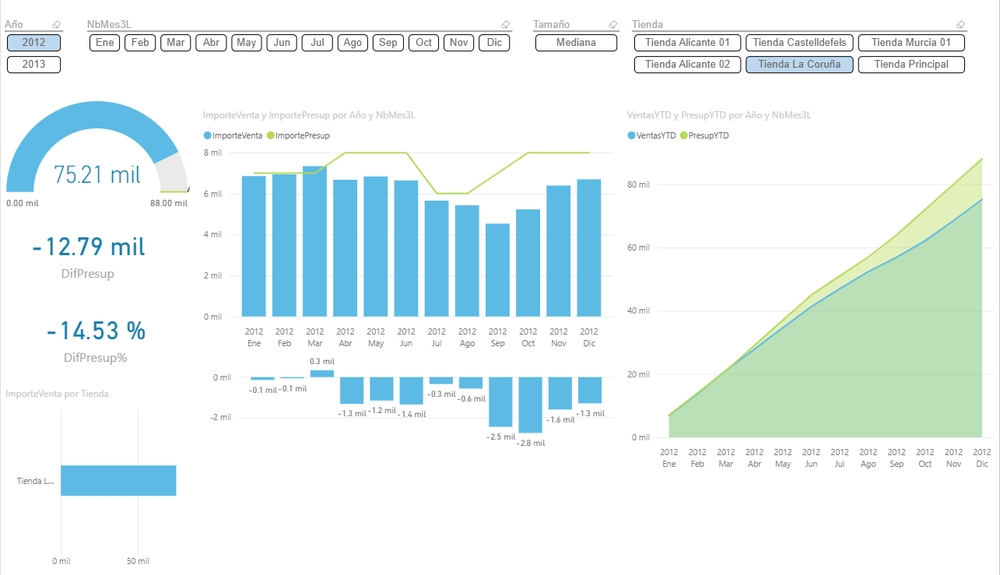
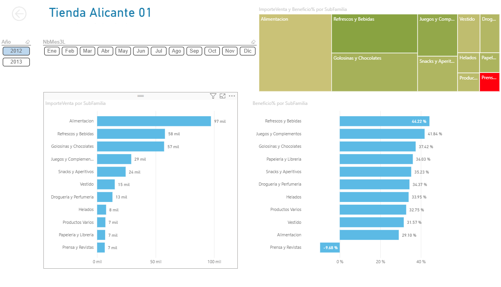

# 📊 Dashboard de Análisis de Ventas - TechZone

Este proyecto consiste en un tablero interactivo de Power BI para analizar el rendimiento comercial de una tienda de tecnología.

## 📸 Galería del Reporte

### 1. Vista General (KPIs y Tendencias)

### 2. Ranking de Productos y Rentabilidad

### 3. Distribución Geográfica

## 🛠️ Herramientas Utilizadas
* **Power BI Desktop:** Modelado de datos y visualización.
* **DAX:** Creación de medidas calculadas (Márgenes, Variación YoY).
* **Power Query (ETL):** Limpieza y transformación de datos.

---
*Desarrollado por [Jireh Aroni]*
